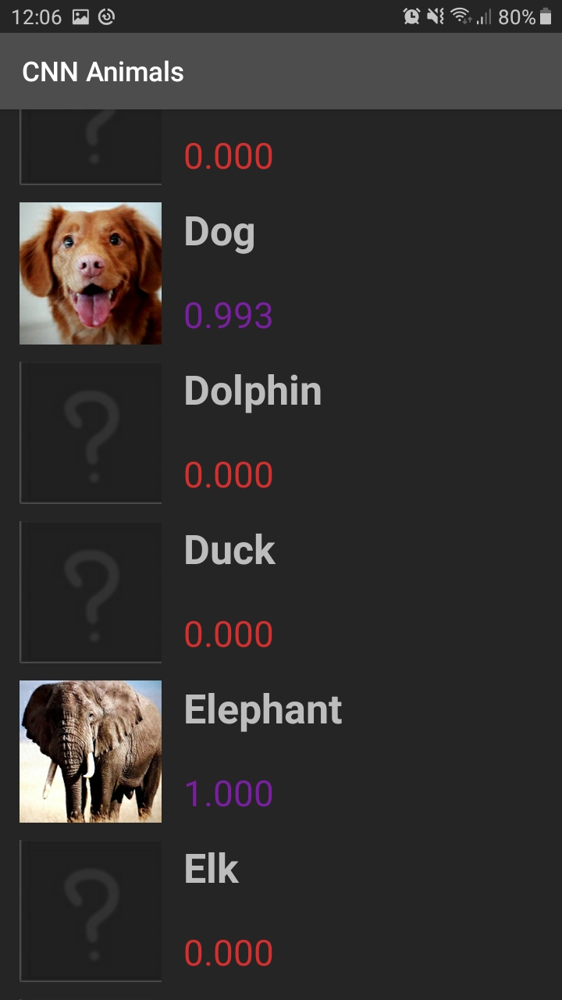

# CNNAnimals

This is an app I made as a part of my [Bachelor's thesis](https://dabar.srce.hr/en/islandora/object/etfos%3A2441). It is an Android app written in Java that embeds a convolutional neural network (or CNN) to do classification on images of animals. By default the CNN used is a MobileNetV2 network pretrained on the ImageNet dataset, Transfer Learned on the dataset of animals. This was done with TensorFlow. Trained model was ported to Android using TFLite.

After opening the app, you can see that the screen is mostly empty, with a button *OPEN CAMERA* below. Pressing this button will start the camera feed allowing you to capture an image.

Now we can take a picture of this cute dog. Ensure the quality of the image is solid, then press *TAKE PICTURE*.

The image turned out alright! As you can see below, the CNN is 99.3% certain that is a dog in the image. Indeed, that is a dog. We can now go to our database of animals using the hamburger menu (shown further below) and see our dog!

Here is our cute dog saved in the database. There is also a picture of the elephant, for which the CNN was 100% certain. Some animals, like the dolphin, the duck, elk, and others, are not yet found, so their image is missing and the value of 0 is shown next to them.

Numbers are color-coded, so 0.0-0.4 is red, 0.4-0.6 is orange, 0.6-0.7 is yellow, 0.7-0.8 is green, 0.8-0.9 is blue, and 0.9-1.0 is purple. We can press on the dog to get more information about the entry. 

For each animal, we count how many times and what is the last time we've seen it. There is the image of our dog, and number 0.9926231 below it, so our CNN was actually 99.26231% sure that it is indeed a dog!

Below is a description of the dog, which is pulled from the Wikipedia. Pressing on the *FIND OUT MORE* button leads you to the [Wiki page](https://en.wikipedia.org/wiki/Dog).

The mentioned hamburger menu is shown here below. It has four sections: Animal Database, About, Help and Preferences.

Animal database is the shown database of found images. About section gives more insight about the app. Help section explains how to use the app. 

Preferences section is used to switch between CNN models. As mentioned, the MobileNetV2 with Transfer Learning is the default model for this task. Other alternatives are MobileNetV2 without Transfer Learning and NASNetMobile with Transfer Learning. Their performances are similiar.

So thats the app! It combines the knowledge about Android and about Neural networks to create an animal classificator for smartphones.

Here are some more animals!

